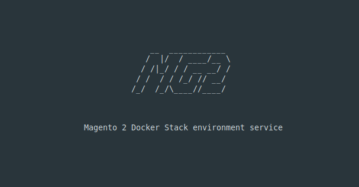

<h1 align="center">Mg2 - Magento Docker Toolset</h1> 

<p align="center"></p>


Mg2 toolset is a system-wide command-line tool for creating and managing simultaneously running Magento Docker projects with insanely easy installation and configuration. It includes plenty of configurable services and useful commands for developing and project orchestration right out of the box. On macOS systems, mutagen.io tool will be bundled in the toolset for high-performance files sync between host and Docker containers.

## Table of contents

- [Prerequisites](#prerequisites)
- [Installation](#installation)
- [What is included](#what-is-included)
    - [Global system-wide services](#global-system-wide-services)
    - [Per-project services](#per-project-services)
- [Usage](#usage)
    - [Interactive project initialization mode](#interactive-project-initialization-mode)
    - [Commandline project initialization mode](#commandline-project-initialization-mode)
    - [CLI Commands reference](#cli-commands-reference)

## Prerequisites

This setup assumes you are running Docker on a computer with at least 6GB of allocated RAM, a dual-core, and an SSD hard drive. 
 
This configuration has been tested on macOS. Linux based systems still require testing. Any testing are welcomed!

## Installation

To install zerocool78 toolset to your system, simply run command below.

```bash
curl -sL raw.githubusercontent.com/zerocool1978/magento2-docker/master/get | bash
```

## What is included

### Global system-wide services 

After toolset is installed, you will have the next tools available locally:

**Traefik** - `https://traefik.mg2.test`
> Traefik is the leading open source reverse proxy and load balancer for HTTP and TCP-based applications that is easy, dynamic, automatic, fast, full-featured, production proven, provides metrics, and integrates with every major cluster technology. <a href="https://containo.us/traefik" target="_blank">https://containo.us/traefik</a>
>
**Portainer** - `https://portainer.mg2.test`
> Portainer is a lightweight management toolset that allows you to easily build, manage and maintain Docker environments. Created by experts, Portainer is an opinionated toolset that captures years of experience to allow you to reliably and quickly create, operate and trouble-shoot your Docker environments. <a href="https://portainer.io" target="_blank">https://portainer.io</a>

**Mailhog** - `https://mailhog.mg2.test`
> MailHog is an email testing tool for developers. Allows to view messages in the web UI, or retrieve them with the JSON API. Optionally allows to release messages to real SMTP servers for delivery. <a href="https://github.com/mailhog/MailHog" target="_blank">https://github.com/mailhog/MailHog</a>

**Dnsmasq** - `https://dnsmasq.mg2.test`
> Dnsmasq provides network infrastructure for small networks: DNS, DHCP, router advertisement and network boot. It is designed to be lightweight and have a small footprint, suitable for resource constrained routers and firewalls. <a href="http://www.thekelleys.org.uk/dnsmasq/doc.html" target="_blank">http://www.thekelleys.org.uk/dnsmasq/doc.html</a>

Toolset local homepage with links to all tools listed above - `https://mg2.test`

**All Docker images with services listed above required to be active for toolset functioning.**  
These services are configured to start automatically and should not be stopped. Without active Traefik and Dnsmasq, mg2 backed projects can't work properly.  

If you don't want auto-start of these services, you can disable it with the command below.

```bash
mg2 global autostart off
```

### Per-project services

Most of services are available with version on your choice.

All Magento Docker projects initialized with: 

- Nginx
- PHP-FPM
- MariaDB
- Redis
- Xdebug

And optionally available:

- Varnish
- Elasticsearch
- phpMyadmin
- RabbitMQ 

## Usage

After toolset is installed on your system, you may use it to initialize new or existing magento projects.

To get a list of all commands and usage information, run command below.

```bash
mg2 --help
```

### Interactive project initialization mode

To initialize project, open the desired directory with terminal and run

```bash
mg2 init
```

This command will launch project initialization in interactive mode. Simply follow the steps to configure the desired Magento Docker development environment.

### Commandline project initialization mode

If at least one command argument is defined, automated setup will be started. All undefined parameters will be set with default values.

```bash
mg2 init [parameters...] [flags...]
```

To get a list of all available parameters and flags for project configuration, run 

```bash
mg2 init --help
```

### CLI Commands reference

#### Project area commands 

```bash
mg2 add service <service> [--help]
mg2 add domain <domain> [--help]
mg2 add [--help]
``` 
Adds optional service or extra domain to the project. Available optional services are: `elasticsearch`, `phpmyadmin`, `rabbitmq` and `varnish`. Run `mg2 add --help` for command usage information.

```bash
mg2 bash [--debug] [--root] ...
```
Opens the bash prompt on the project's php Docker service.  With `--debug` flag, the bash prompt will be opened on the project's xdebug Docker service. With `--root` flag, the root user will be used.

```bash
mg2 cli [--debug] [--root] ...
```
Runs any CLI command without going into the bash prompt of the project's php service. With `--debug` flag, the CLI command will run on the project's xdebug service. With `--root` flag, the root user will be used.

```bash
mg2 composer <command> [options] [arguments]
```
Runs [Composer](https://getcomposer.org) specific commands. Run `mg2 composer` for command usage information.

```bash
mg2 db [command] [--help]
```
Database related commands. Import/Export database commands and MySQL CLI tool access. Available optional services are: `export`, `import` and `mysql`. Run `mg2 db --help` for command usage information.

```bash
mg2 down
```
Removes project Docker containers, volumes, and networks. Project sources on the host will be untouched. Don't forget to create a database backup before running this command.

```bash
mg2 grunt
```
The grunt command-line interface. Runs grunt specific commands at projects Docker container. Run `mg2 grunt --help` for command usage information.

```bash
mg2 info
```
Prints project info and Docker containers status.

```bash
mg2 init
```
Initializes project in the current directory. Run `mg2 init --help` for command usage information.

```bash
mg2 m
```
Magento command-line tool interface. Runs `bin/magento` specific commands at projects Docker container.  Its is shortened alias of `mg2 magento` command.

```bash
mg2 mr
```
N98-magerun command-line tool interface. Runs `n98-magerun` specific commands at projects Docker container. It is shortened alias of `mg2 magerun` command. Run `mg2 mr --help` for command usage information.

```bash
mg2 node 
```
Node command-line tool interface. Runs `node` specific commands at projects Docker container. Run `mg2 node --help` for command usage information.

```bash
mg2 npm
```
NPM command-line tool interface. Runs `npm` specific commands at projects Docker container. Run `mg2 npm --help` for command usage information.

```bash
mg2 pwa <command|script> [--help]
```
PWA Studio related commands and wrapper for `yarn run` command inside of project directory. Run `mg2 pwa --help` for command usage information.

```bash
mg2 redis [options] [cmd [arg [arg ...]]]
```
Redis command-line tool interface. Runs `redis-cli` specific commands at projects Redis Docker container. Run `mg2 redis --help` for command usage information.

```bash
mg2 remove [service] [--help]
```
Removes optional service from the project. Available optional services are: `elasticsearch`, `phpmyadmin`, `rabbitmq` and `varnish`. Run `mg2 remove --help` for command usage information.

```bash
mg2 restart [service [service ...]]
```
Restarts running project Docker services and starts all stopped ones. If services are explicitly specified, only specified will be restarted.

```bash
mg2 share [region] [--help]
```
Starts sharing session over [ngrok](https://ngrok.com) secure tunnels. Command accepts an optional parameter to specify a region. Ex. `mg2 share eu`. Available regions are `us`, `eu`, `ap`, `au`, `sa`, `jp`, and `in`. By default, region is `us`. For proper functioning of this command, required dependencies will be installed. Run `mg2 share --help` for command usage information. 

```bash
mg2 sign [domain [domain ...]]
```
Signs SSL certificate for provided domain names. Only domains with .test TLD are allowed.  

```bash
mg2 start [service [service ...]]
```
Starts stopped project services. If services are explicitly specified, only specified will be started.

```bash
mg2 status
```
Prints project information and services status.

```bash
mg2 stop [service [service ...]]
```
Stops active project services. If services are explicitly specified, only specified will be stopped.

```bash
mg2 sync [command] [--help]
```
Controls the synchronization sessions between host and docker container.

```bash
mg2 update
```
Updates the project's docker configuration to the latest version.

```bash
mg2 urn
```
Generates Uniform Resource Names (URN) for PHPStorm and remaps paths for the host.

```bash
mg2 varnish <tool>
```
Run varnish command line tools such as `varnishadm`, `varnishhist`, `varnishstat`, `varnishtop`, `varnishtest`, `varnishlog` etc.

### Acknowledgment

Original Project Mage2click by  Dmitry Shkoliar 

## License

MIT
